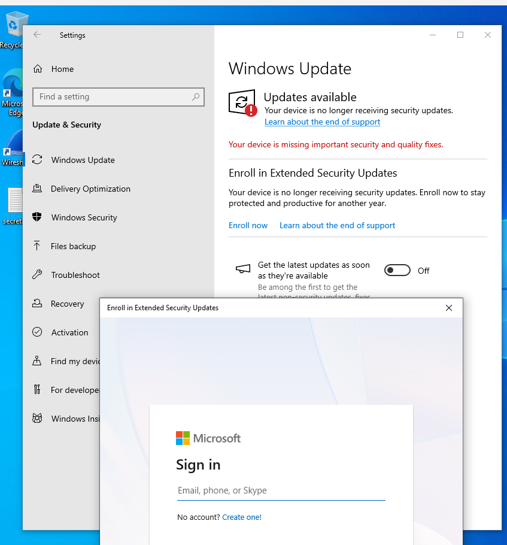
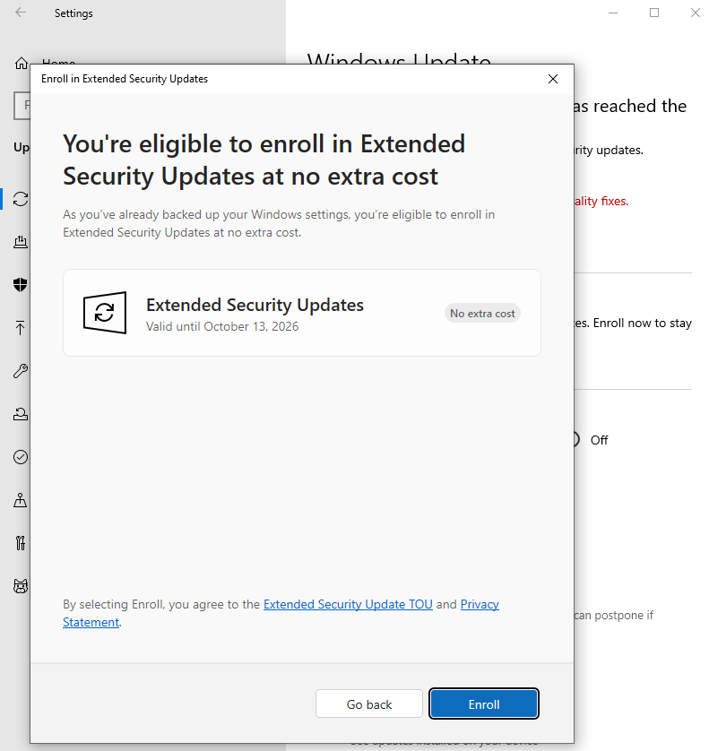
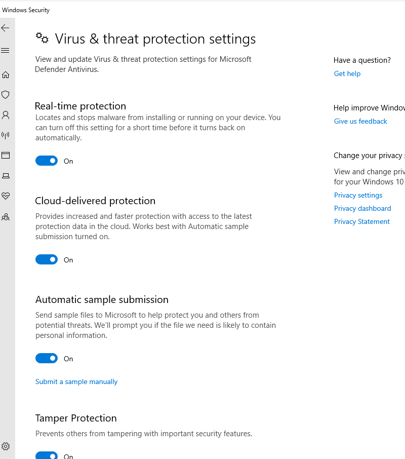
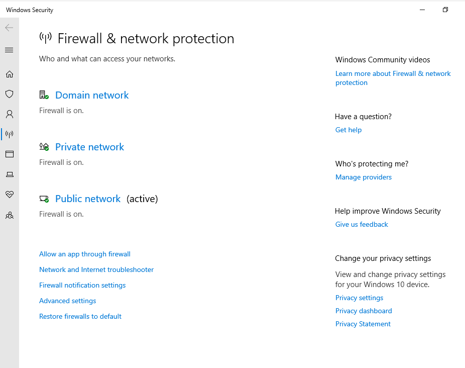
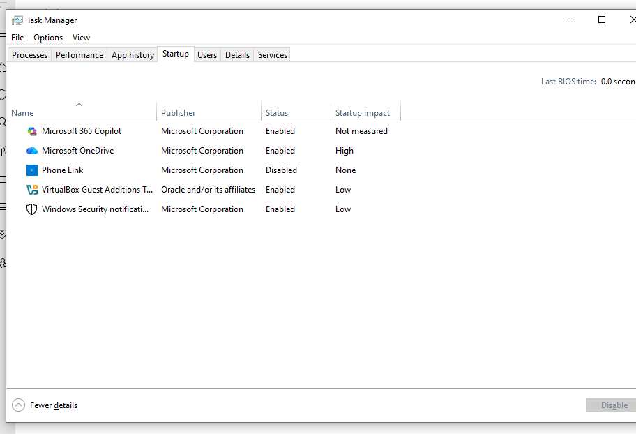
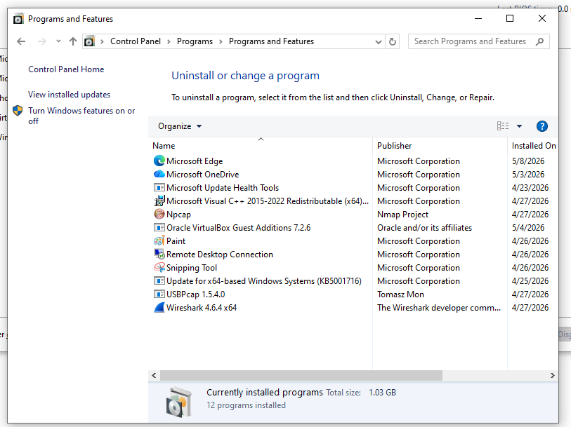
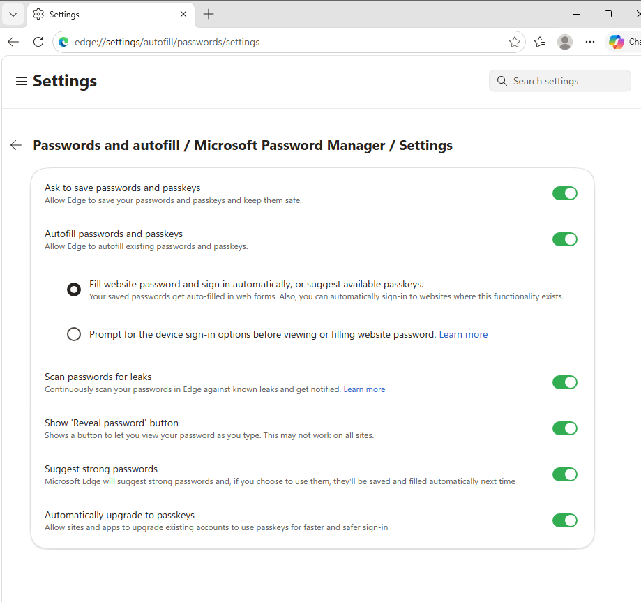
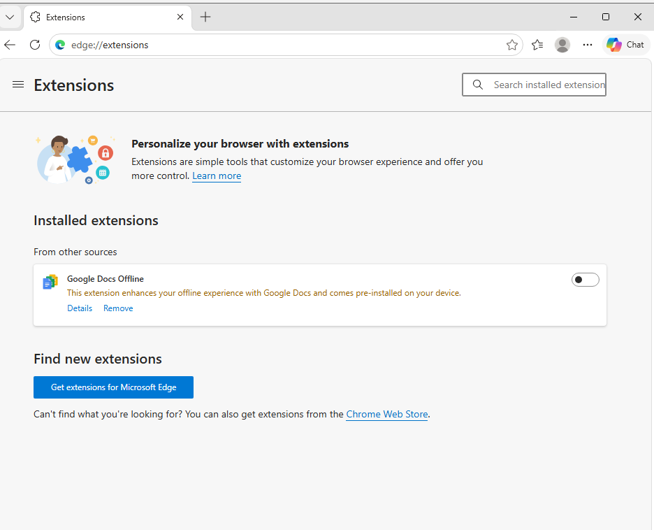
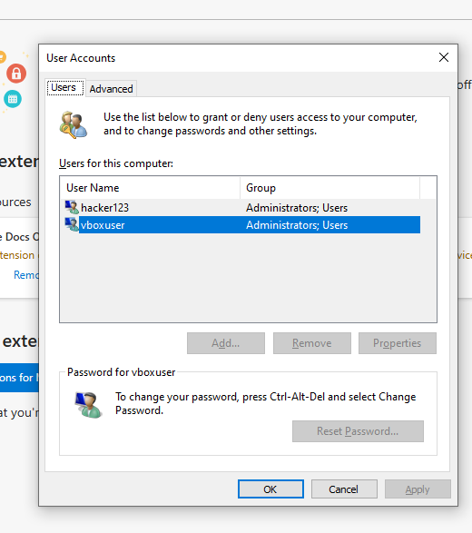

# 🛡️ Windows 10 Security Review & Hardening Lab

## 🎯 Objective
To review and strengthen the security posture of a Windows 10 device by identifying risks, reviewing security settings, and applying security best practices.

---

## 🧠 Scenario
A small business client requests a security review to ensure their device is properly protected against common cyber threats.

---

# 🔍 Step 1: Windows Update Review

### 📍 Navigation
`Settings → Update & Security`

### 📸 Findings
- Device was no longer receiving standard security updates
- Important security and quality fixes were missing

### ⚠️ Security Risk
Unsupported systems may become vulnerable to:
- Malware
- Ransomware
- Unpatched vulnerabilities

### ✅ Action Taken
Enrolled device into a supported update/security model using a separate lab Microsoft account.

### 💬 Client Recommendation
Devices should remain on supported operating system versions to continue receiving security updates and security patches.

---

# 🛡️ Step 2: Windows Defender Review

### 📍 Navigation
`Windows Security → Virus & Threat Protection Settings`

### ✅ Security Protections Reviewed
- Real-time protection → ON
- Cloud-delivered protection → ON
- Automatic sample submission → ON
- Tamper Protection → ON

### 🧠 Assessment
The device had strong baseline antivirus protections enabled.

### 💬 Client Explanation
Security protections were enabled to help detect malware, improve threat intelligence, and prevent malicious software from disabling protections.

---

# 🔥 Step 3: Firewall Review

### 📍 Navigation
`Firewall & Network Protection`

### ✅ Findings
- Domain firewall → ON
- Private firewall → ON
- Public firewall → ON

### 🧠 Assessment
Firewall protections were correctly enabled across all network profiles.

### ⚠️ Why This Matters
Firewall protections help reduce exposure to:
- Unauthorised network access
- Malicious inbound connections
- Public network threats

---

# 🚀 Step 4: Startup Program Review

### 📍 Navigation
`Task Manager → Startup`

### 📸 Findings
Reviewed startup applications including:
- Microsoft OneDrive
- Windows Security Notifications
- VirtualBox Guest Additions

### 🧠 Assessment
- No suspicious startup programs identified
- OneDrive noted as having higher startup impact

### 💬 Recommendation
Startup applications should be reviewed regularly to reduce unnecessary performance impact and minimise attack surface.

---

# 🔧 Step 5: Installed Applications Review

### 📍 Navigation
`Control Panel → Programs & Features`

### 📸 Findings
Installed applications reviewed included:
- Microsoft Edge
- Wireshark
- Npcap
- VirtualBox components

### 🧠 Assessment
- No suspicious software identified
- Applications appeared legitimate and expected within the lab environment

---

# 🌐 Step 6: Browser Security Review

### 📍 Navigation
`Microsoft Edge → Password & Security Settings`

### ✅ Findings
- Strong password suggestions enabled
- Passkey support enabled
- No saved passwords identified

### ⚠️ Recommendation
Enable password leak detection for improved credential monitoring.

---

# 🔍 Step 7: Browser Extension Review

### 📍 Navigation
`Edge Extensions`

### 📸 Findings
- Google Docs Offline extension identified
- No suspicious extensions detected

### 🧠 Assessment
No high-risk or malicious browser extensions were identified.

---

# 👤 Step 8: User Account Review

### 📍 Navigation
`netplwiz`

### 📸 Findings
Two administrator accounts identified:
- vboxuser
- hacker123

### ⚠️ Security Observation
Additional administrator accounts should always be reviewed and verified.

### 💬 Client Recommendation
Unused or unrecognised administrator accounts should be removed or disabled to reduce security risk.

---

# 🧾 Final Assessment

## ✅ Overall Security Status
Moderate to Strong baseline protection.

---

## 🔥 Key Security Strengths
- Defender protections enabled
- Firewall enabled across all profiles
- No suspicious software detected
- Browser protections configured

---

## ⚠️ Key Recommendations
- Ensure operating system remains supported and updated
- Enable password leak detection
- Review administrator accounts regularly
- Remove unnecessary startup applications if unused

---

# 🛠️ Service Workflow Demonstrated

This lab demonstrates the process used during a:

## 👉 Device Security Setup & Hardening Service

### Workflow
1. Review update status
2. Assess antivirus protections
3. Review firewall configuration
4. Check startup applications
5. Review installed software
6. Assess browser security
7. Review user accounts
8. Provide recommendations

---

# 💼 Real-World Client Value

This service helps reduce the risk of:
- Malware infections
- Credential theft
- Unauthorised access
- Outdated software vulnerabilities
